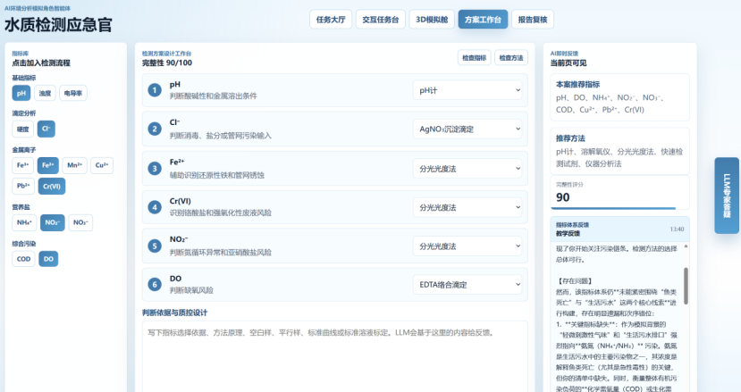
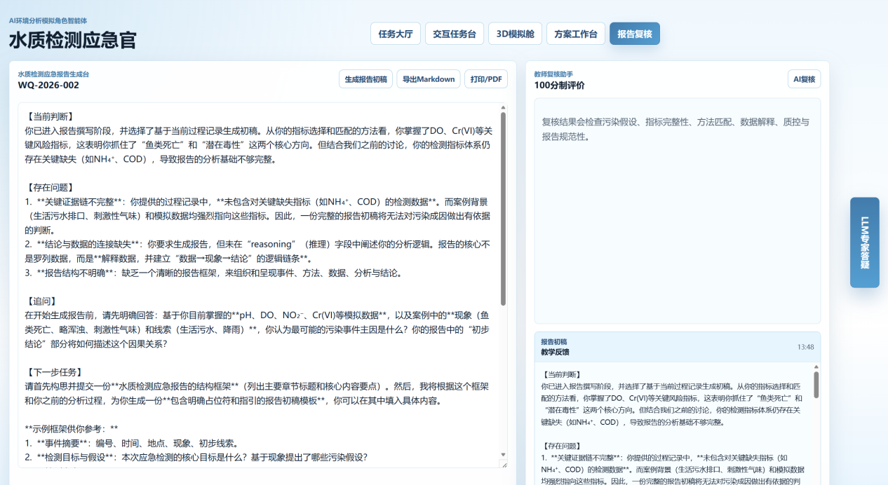
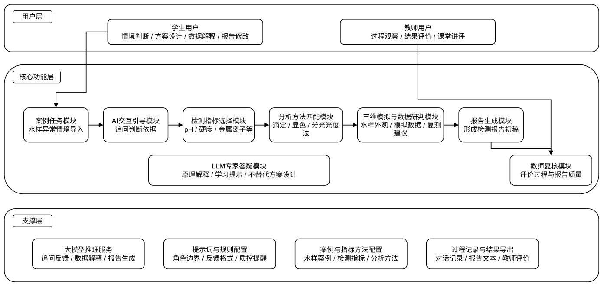
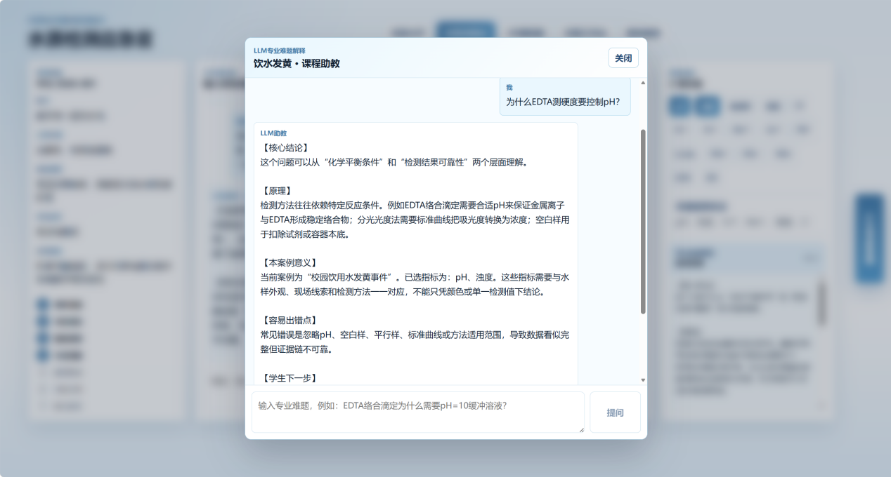
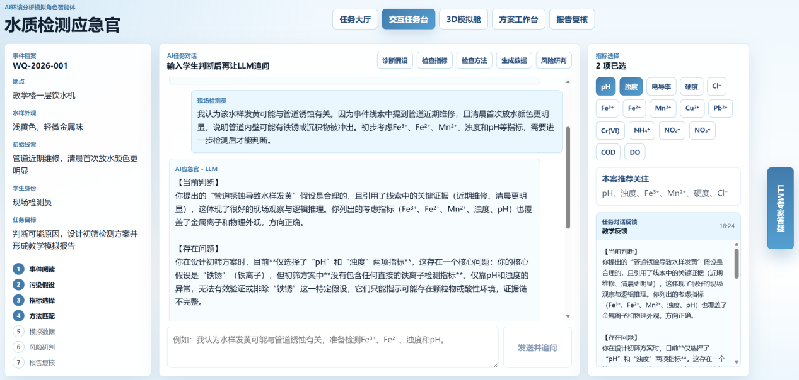

# 水质检测应急官


- 任务大厅、交互任务台、3D水样模拟舱、检测方案工作台、报告复核页。
- Express 后端 LLM 代理，读取 `.env` 或 `LLM信息.txt` 中的 DeepSeek OpenAI 兼容配置。
- Three.js 透明采样瓶、水体颜色、浊度粒子、底部沉淀和风险光效。
- 每个 AI 按钮都会在当前页面显示“AI即时反馈”，避免点击后不知道结果去了哪里。
- 右侧固定“LLM专家答疑”按钮，可弹窗解释 EDTA 滴定、分光光度、质控设计等专业难题。

## 项目截图











## 运行

```bash
npm install
npm run dev
```

前端默认地址：`http://127.0.0.1:5173`

后端默认地址：`http://127.0.0.1:8787`

## DeepSeek 配置

优先读取环境变量：

```bash
DEEPSEEK_API_KEY=your_deepseek_api_key
DEEPSEEK_BASE_URL=https://api.deepseek.com
DEEPSEEK_MODEL=deepseek-v4-flash
```

如果没有设置环境变量，后端会尝试从项目根目录的 `LLM信息.txt` 解析 `api_key`、`base_url` 和 `model`。
本项目仍使用 `openai` npm 包作为兼容 SDK，实际请求地址与模型已经切换为 DeepSeek。

## 课堂使用建议

1. 先在任务大厅选择案例。
2. 进入交互任务台，让学生提交污染假设。
3. 在方案工作台选择指标、匹配方法并写依据。
4. 在3D模拟舱展示污染类型、浊度、沉淀和风险联动。
5. 随时点击右侧“LLM专家答疑”解释专业难点。
6. 在报告复核页生成报告初稿，并用教师复核助手给出修改意见。
